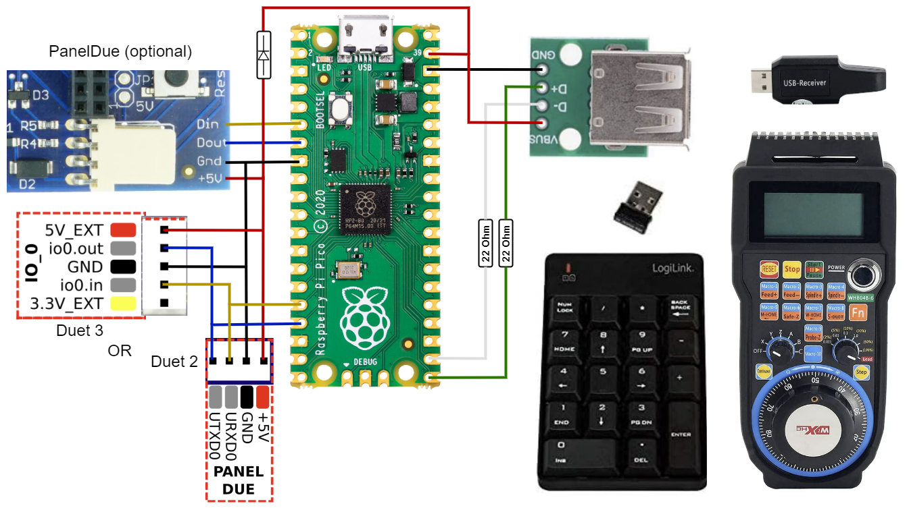

# Duet USB CNC Pendant
(work in progress / use at own risk)

This project is inspired and partly based on:
- [**Duet CNC-Pendant-Firmware**](https://github.com/Duet3D/CNC-Pendant-Firmware)
- [Adafruit TinyUSB HID Example](https://github.com/adafruit/Adafruit_TinyUSB_Arduino/tree/master/examples/DualRole/HID/hid_device_report)

It uses the GPIO ports of a **Raspberry Pi Pico** to create an USB Host Port (using [Pico-PIO-USB](https://github.com/sekigon-gonnoc/Pico-PIO-USB)) to listen for input from USB devices and generates G-Code commands to control a Duet based CNC machine.

First, the idea was to just use a simple wireless numpad for jogging.  
But I later got the idea that a feature rich CNC pendant (like the WHB04B-6) should be possible, too.  
So it also can read object model status responses from the Duet to pass the current axis coordinates to the pendant for displaying.

It is also possible to connect and use multiple USB devices at the same time via a USB hub.

Implementation is limited so far, see functions below.

## Supported Devices

### LogiLink ID0120 Numpad
* Arrow keys are used for jogging X/Y axes, +/- for Z axis as single step per key press.
* Keys in the top row is used to set step size (off/0.1mm/1mm/10mm).
* Other keys try to executing a macro on the Duet.
* On any key press, the Numlock LED is toggled as feedback
* [Experimental Continuous Mode](doc/ContinuousMode.md)

Other numpads should work as well, just change USB VID and PID in main1.cpp / tuh_hid_mount_cb().

### WHB04B-6 Wireless CNC Pendant
* Jogging with wheel with selected axis and step size (0.001mm/.../1mm).
* Changing jogging feed rate with Feed+/- buttons
* Display shows axis coordinates, spindle speed, jogging feed rate
* Most buttons simply try executing macros on the Duet.

Implementation is based on information from https://github.com/LinuxCNC/linuxcnc/tree/master/src/hal/user_comps/xhc-whb04b-6

### PS3 DualShock 3 Controller
* Jogging with directional buttons for X/Y axes, left and right shoulder buttons for Z axis.
* Trigger buttons to change step size (off/0.01mm/0.1mm/1mm/10mm).
* Current step size is indicated by the controller number indicator LEDs (1=0.01mm, ... , 4=10mm).
* Other buttons simply try executing macros on the Duet.
* [Experimental Continuous Mode](doc/ContinuousMode.md)

### Other
Implementing other USB HID devices can be done by adding a adequate Pendant class and extending main1.cpp / tuh_hid_mount_cb().

## Wiring

### USB Pendant Socket
| RPi Pico | USB A Socket | Note                |
|----------|--------------|---------------------|
| GPIO 16  | D+           | via 22 Ohm Resistor |
| GPIO 17  | D-           | via 22 Ohm Resistor |
| VSYS     | VBUS         |                     |
| GND      | GND          |                     |

### Serial to Duet
| RPi Pico           | Duet 2 | Duet 3  | Note      |
|--------------------|--------|---------|-----------|
| GPIO 12 (UART0 TX) | URXD0  | io0.in  |           |
| GPIO 13 (UART0 RX) | UTXD0  | io0.out |           |
| VSYS               | 5V_EXT | +5V     | via Diode |
| GND                | GND    | GND     |           |

### PanelDue Serial Passthrough (optional)
| PanelDue | RPi Pico          | Duet         |
|----------|-------------------|--------------|
| Din      | GPIO 4 (UART1 TX) |              |
| Dout     | GPIO 5 (UART1 RX) |              |
| +5V      |                   | 5V_EXT / +5V |
| GND      | GND               | GND          |

## Installation
* Compile and flash with PlatformIO, or
* Copy firmware.uf2 to the RPI Pico after pressing BOOTSEL button while connecting to PC

## Development Info
- Multicore usage
    - Core 0 is used for Serial connection stuff (main.cpp):  
      forwarding commands to Duet, handle PanelDue/Duet passthrough, parsing object model status messages 
    - Core 1 is used to USB stuff (main1.cpp):  
      connection events, handle HID reports, generate commands from inputs of connected devices
    - rp2040.fifo is used to pass:
        - generated commands from Core1 to Core 0 (as DuetStatus struct object)
        - status messages from Core0 to Core 1 (as String object)
- Classes:
    - USBHIDPendant:
        - base class device implementation:
        - has helper functions for key press/release handling
        - used by:
            - Pendant_Numpad: implementation for LogiLink Numpad
            - Pendant_WHB04B6: implementation for WHB04B6 Wireless CNC Pendant
    - JSONReader: helper for identifying/buffering object model status messages from Duet
- USB device mount handling (main1.cpp):
    - on mount event and if device is supported, an object for the matching class is created and stored in `devices` (array of struct USBHIDPendantDevice)
    - on unmount, if device is in `devices`, class object is destroyed
- Known Issues:
    - Adafruit TinyUSB Library >=2.0.0 is not working with PlatformIO (?)
    - no unmount events issued with PlatformIO  
      implemented workaround: periodic check if still mounted
- Not implemented yet:
    - continuous movement and long key press handling
    - special emergency stop handling
